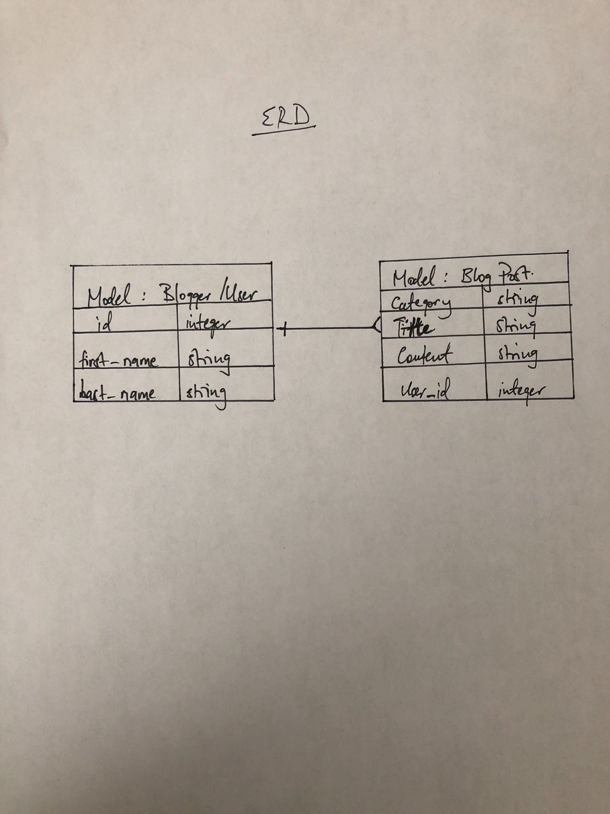

# GENERAL ASSEMBLY SEI CAPSTONE (Full-stack-project)

## ABOUT THE APP
  The Round Table app is a CRUD blog application that lets signed users create blog posts with a couple of different categories. The app also allows both authenticated and non authenticated users to view all available blog posts whether or not they are signed as I think it is an essential part of any blog site. That said, non authenticated users don't have the abilty to perform the create and delete actions as those are reserved for signed in users.

## DEVELOMENT PROCESS
  I started the backend develoment process with drawing out an ERD of what I thought the app would like. From there, I went on to create on to create a new app in Rails since I was planning on using Rails in the backend. After setting up the resource and migrating it both in Rails and heroku, I designed how I wanted the permissions to reflect in the front end; who would be allowed to create, edit, delete and who would only be allowed to view the posts if they didn't have an account. Once all that was done, I pushed up the code to github and heroku.

  ## USER STORIES
   - As a user, I want to be able to sign-up
   - As a user, I want to be able to sign-in
   - As a user, I want to be able to change password
   - As a user, I want to be able to sign-out
   - As a user, I would like success/failure messages when I have completed an auth action.
   - As a signed in user, I would like to view all blog posts
   - As a signed in user, I would like to view one blog posts
   - As a signed in user, I would like to comment on a blog post
   - As a signed in user, I would like to delete a blog post
   - As an unregisted user, I would like to be able to view all available blogs
   - As an unregisted user, I would like to be able to view a single blog

  ## TECHNOLOGIES
  - Ruby
  - Ruby on Rails
  - Heroku
  - Github
  - Git

  ## INSTALLATION
  - fork and clone
  - bundle install
  - bin/rails server

  ### API Routes and Paths
| Verb   | URI Pattern            | Controller#Action |
|--------|------------------------|-------------------|
| POST   | `/sign-up`             | `users#signup`    |
| POST   | `/sign-in`             | `users#signin`    |
| DELETE | `/sign-out`            | `users#signout`   |
| PATCH  | `/change-password`     | `users#changepw`  |
| POST   | `/create-blog`         | `blog#create`     |
| GET    | `/blogs`               | `blogs#index`     |
| GET    | `/blogs/:id`           | `blogs#show`      |
| PATCH  | `/blogs/:id/edit`      | `blogs#update`    |
| DELETE | `/blogs/:id/`          | `blogs#delete`    |

  ## LINKS

  [Deployed BackEnd API](https://coldworld.herokuapp.com/)

  [FrontEnd repo](https://github.com/mwwasswa/TheRoundTable_client)

  [Deployed FrontEnd Client](https://mwwasswa.github.io/TheRoundTable_client/#/)

  ## ERD

  

  ## WOULD LIKE TO ADD
   - I would like to give the user to ability to add pictures to their posts
